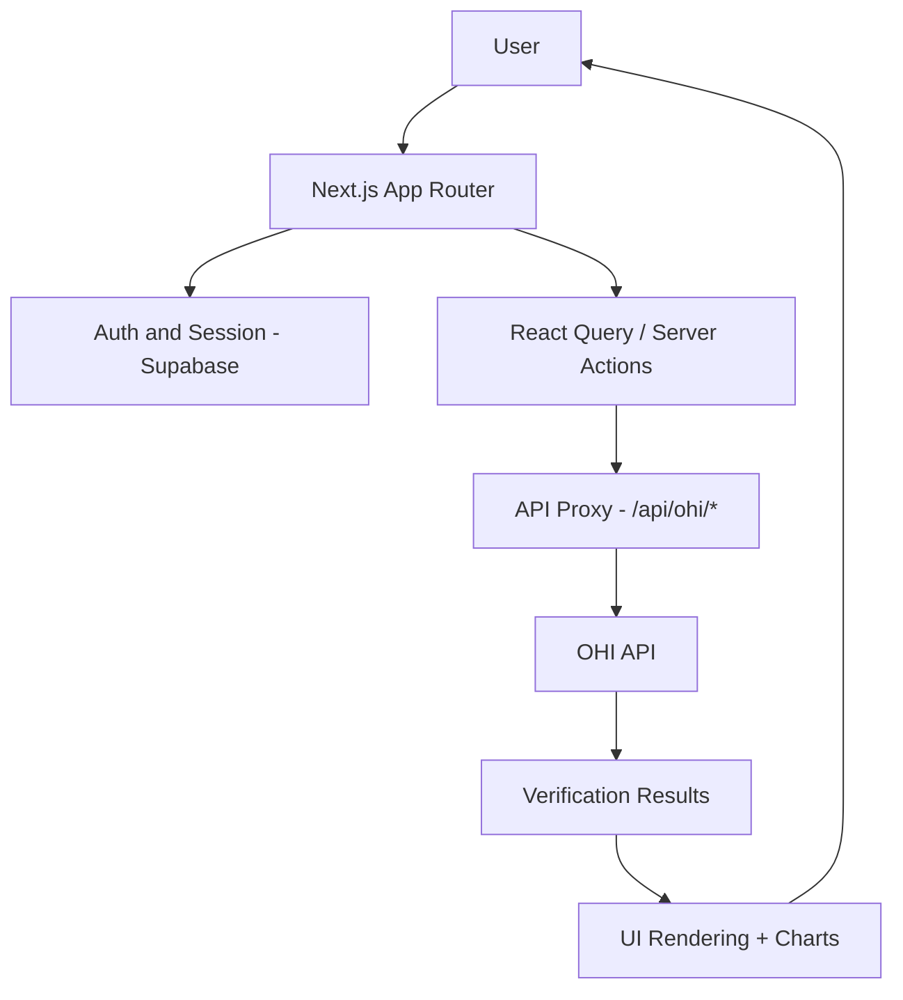
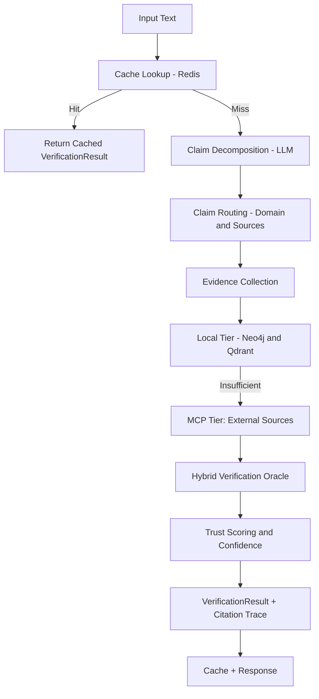
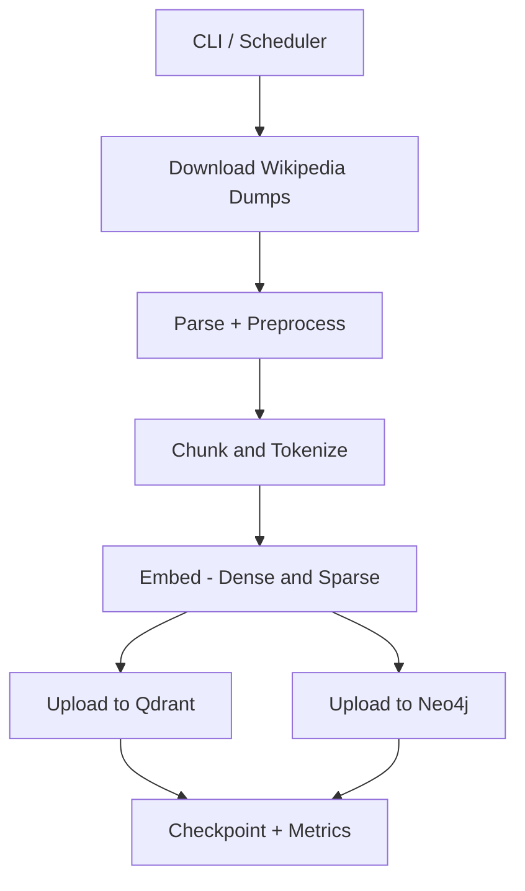
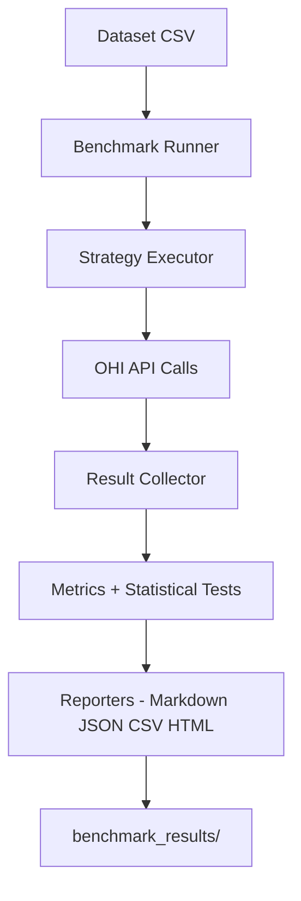

<p align="center">
  
</p>

<h1 align="center">Open Hallucination Index</h1>

<p align="center">
  <strong>🔍 Scientifically grounded real-time fact-checking for LLM outputs</strong>
</p>

<p align="center">
  <a href="#project-overview">Project Overview</a> •
  <a href="#-part-1--saas-web-application">SaaS Website</a> •
  <a href="#-part-2--ohi-verification-service">OHI Service</a> •
  <a href="#-part-3--benchmarking--evaluation">Benchmarking</a> •
  <a href="#getting-started">Getting Started</a> •
  <a href="#contributing">Contributing</a>
</p>

<p align="center">
  
  
  <a href="https://github.com/shiftbloom-studio/open-hallucination-index/actions"></a>
</p>

---

**Open Hallucination Index (OHI)** is a high-performance middleware and analysis platform that decomposes LLM outputs into atomic claims, verifies them against curated knowledge sources, and calculates a traceable trust score in real-time. The focus is on reproducible, evidence-based hallucination detection with clear interfaces for research, production use, and auditability.

## 🧭 Project Overview

The project is organized into **three distinct parts**, each with its own purpose, technology stack, and workflows:

| # | Part | What it does | Tech Stack |
|---|------|-------------|------------|
| 1 | [**SaaS Web Application**](#-part-1--saas-web-application) | User-facing website with authentication, token-based billing, dashboards, and evidence visualization | Next.js, React, Supabase, Stripe |
| 2 | [**OHI Verification Service**](#-part-2--ohi-verification-service) | Core algorithm that decomposes text into claims, retrieves evidence from multiple knowledge sources, and computes trust scores | FastAPI, Neo4j, Qdrant, Redis, MCP |
| 3 | [**Benchmarking & Evaluation**](#-part-3--benchmarking--evaluation) | Research-grade test suite comparing OHI accuracy and performance against other hallucination detection approaches | Python, statistical testing, HuggingFace datasets |

```
┌──────────────────────────────────────────────────────────────────────────┐
│                        Open Hallucination Index                          │
│                                                                          │
│  ┌──────────────────┐  ┌──────────────────────┐  ┌───────────────────┐  │
│  │  Part 1: SaaS    │  │  Part 2: OHI Service │  │  Part 3: Bench-  │  │
│  │  Web Application │  │  & Algorithm         │  │  marking & Eval  │  │
│  │                  │  │                      │  │                   │  │
│  │  Next.js UI      │─▶│  FastAPI API          │◀─│  Benchmark Suite  │  │
│  │  Supabase Auth   │  │  MCP Server          │  │  Statistical      │  │
│  │  Stripe Billing  │  │  Neo4j + Qdrant      │  │  Analysis         │  │
│  │  Dashboard       │  │  Claim Decomposition │  │  Strategy Compare │  │
│  └──────────────────┘  └──────────────────────┘  └───────────────────┘  │
│                                                                          │
│         src/frontend/       src/api/ + src/ohi-mcp-server/               │
│                             gui_ingestion_app/        gui_benchmark_app/ │
└──────────────────────────────────────────────────────────────────────────┘
```

---

## 🌐 Part 1 — SaaS Web Application

The user-facing website provides authentication, token-based billing, interactive dashboards, and evidence visualization for verification results.

**Directory:** [`src/frontend/`](src/frontend/) · **Guide:** [src/frontend/README.md](src/frontend/README.md)

### Technology

| Technology | Purpose |
|-----------|---------|
| **Next.js 16** (App Router) | Server Components, Server Actions, routing |
| **React 19 + TypeScript** | UI components and type safety |
| **Tailwind CSS 4 + shadcn/ui** | Styling and design system |
| **Supabase** | Authentication (OAuth), user profiles, token tracking |
| **Stripe** | Token-based billing (one-time purchases, webhook processing) |
| **React Query** | API state management and caching |

### Key Features

- **Authentication & Sessions** — Supabase OAuth login/signup with protected routes and middleware
- **Token-Based Billing** — Three purchase tiers (Starter / Professional / Enterprise) via Stripe checkout; free daily tokens for registered users
- **Verification Dashboard** — Submit claims, view real-time verification results, and explore evidence traces
- **Evidence Traceability** — Drill down into source provenance, confidence intervals, and citation chains
- **API Proxy** — Server-side proxy at `/api/ohi/*` forwards requests to the OHI API, injecting authentication
- **Legal & Compliance** — Terms of Service, Privacy Policy, Cookie Policy, Accessibility statement

### Frontend Workflow



### Frontend Setup

```bash
cd src/frontend
npm install
npm run dev      # Development server
npm run test     # Unit tests
npm run lint     # Linting
npm run test:e2e # E2E tests (Playwright)
```

Environment variables (create `src/frontend/.env.local`):
```env
DEFAULT_API_URL=http://localhost:8080
DEFAULT_API_KEY=your-api-key
NEXT_PUBLIC_SUPABASE_URL=your-supabase-url
NEXT_PUBLIC_SUPABASE_ANON_KEY=your-supabase-anon-key
STRIPE_SECRET_KEY=your-stripe-secret-key
STRIPE_WEBHOOK_SECRET=your-stripe-webhook-secret
```

---

## ⚙️ Part 2 — OHI Verification Service

The core engine that powers hallucination detection. It decomposes text into atomic claims, retrieves evidence from local and external knowledge sources, and computes traceable trust scores with confidence intervals.

### Components

| Component | Directory | Purpose |
|-----------|-----------|---------|
| **Verification API** | [`src/api/`](src/api/) | FastAPI backend orchestrating claim decomposition, verification, and scoring |
| **MCP Server** | [`src/ohi-mcp-server/`](src/ohi-mcp-server/) | Aggregates 13+ external knowledge sources (Wikipedia, PubMed, OpenAlex, etc.) via MCP protocol |
| **Ingestion Pipeline** | [`gui_ingestion_app/`](gui_ingestion_app/) | Populates Neo4j and Qdrant with Wikipedia knowledge for local verification |
| **Infrastructure** | [`docker/`](docker/) | Docker Compose stack with Neo4j, Qdrant, Redis, vLLM, Nginx |

**Guides:** [src/api/README.md](src/api/README.md) · [src/ohi-mcp-server/README.md](src/ohi-mcp-server/README.md) · [gui_ingestion_app/README.md](gui_ingestion_app/README.md) · [docker/README.md](docker/README.md)

### How It Works

1. **Claim Decomposition** — An LLM breaks input text into atomic, independently verifiable claims
2. **Evidence Retrieval** — Claims are routed to knowledge sources based on domain classification:
   - **Local Tier:** Neo4j (exact graph queries) + Qdrant (semantic vector search)
   - **External Tier:** MCP sources (Wikipedia, PubMed, OpenAlex, Crossref, GDELT, and more)
3. **Verification Oracle** — Evidence is evaluated against each claim using configurable strategies
4. **Trust Scoring** — A weighted scorer computes a trust score (0.0–1.0) with confidence intervals
5. **Knowledge Track** — Full provenance chain linking claims → evidence → sources for auditability

### Verification Strategies

| Strategy | Description | Use Case |
|----------|-------------|----------|
| `mcp_enhanced` | Query external sources (Wikipedia, Context7) + local stores | **Recommended** — Most comprehensive |
| `hybrid` | Parallel graph + vector search | Fast local-only verification |
| `cascading` | Graph first, vector fallback | When exact matches preferred |
| `graph_exact` | Neo4j only | Known entity verification |
| `vector_semantic` | Qdrant only | Semantic similarity matching |
| `adaptive` | Tiered retrieval with early-exit heuristics | Balanced speed + coverage |

### Architecture

The API follows a **hexagonal (ports & adapters)** design, making knowledge sources, scoring strategies, and retrieval pipelines fully interchangeable.

| Feature | Description |
|---------|-------------|
| **🧠 Claim Decomposition** | Breaks text into verifiable atomic claims using LLM-powered extraction |
| **📊 Multi-Source Verification** | Validates against Neo4j graph, Qdrant vectors, and MCP sources |
| **⚡ High Performance** | Session pooling, batch processing, parallel verification, Redis caching |
| **🧭 Adaptive Evidence** | Adaptive strategy balances speed and coverage with tiered retrieval |
| **🎯 Trust Scoring** | Evidence-ratio based scoring with confidence intervals (0.0–1.0) |
| **🧩 Knowledge Track** | Source-aware provenance and 3D-mesh graph for each verified claim |
| **🔌 Pluggable Architecture** | Hexagonal design — easily swap knowledge sources and strategies |

### API Verification Workflow



### Ingestion Workflow



### MCP Server Workflow

```mermaid
flowchart TD
  A[MCP Client] --> B["Transport - SSE STDIO"]
  B --> C["Rate Limiter and Cache"]
  C --> D[Tool Router]
  D --> E[Source Adapters (Parallel)]
  E --> F["Normalize and Aggregate"]
  F --> G[Response Payload]
```

### API Setup

```bash
cd src/api
python -m venv .venv
source .venv/bin/activate  # On Windows: .venv\Scripts\activate
pip install -e ".[dev]"
pytest             # Run tests
ohi-server         # Start the API server
```

### Required Services

| Service | Purpose | Documentation |
|---------|---------|---------------|
| **Neo4j** | Graph database for structured knowledge | [neo4j.com](https://neo4j.com/) |
| **Qdrant** | Vector database for semantic search | [qdrant.tech](https://qdrant.tech/) |
| **Redis** | Caching layer (optional) | [redis.io](https://redis.io/) |
| **LLM Service** | For claim decomposition (OpenAI, vLLM, etc.) | [vllm.ai](https://vllm.ai/) |

---

## 📊 Part 3 — Benchmarking & Evaluation

A research-grade benchmark suite that measures how accurate and fast OHI is compared to other broadly used hallucination detection approaches (VectorRAG, GraphRAG). Produces publication-ready reports with statistical rigor.

**Directory:** [`gui_benchmark_app/`](gui_benchmark_app/) · **Guide:** [gui_benchmark_app/README.md](gui_benchmark_app/README.md)

### What It Compares

The benchmark evaluates all six OHI verification strategies against baseline approaches:

| Approach | Type | What It Tests |
|----------|------|---------------|
| `graph_exact` | OHI (Neo4j only) | Pure knowledge-graph lookup (comparable to GraphRAG) |
| `vector_semantic` | OHI (Qdrant only) | Pure semantic vector search (comparable to VectorRAG) |
| `hybrid` | OHI (Graph + Vector) | Parallel graph and vector fusion |
| `cascading` | OHI | Graph first, vector fallback |
| `mcp_enhanced` | OHI | Local + external MCP sources |
| `adaptive` | OHI | Tiered retrieval with early-exit heuristics |

### Metrics

- **Classification:** Accuracy, Precision, Recall, F1, MCC, ROC-AUC, PR-AUC
- **Calibration:** Brier Score, ECE (Expected Calibration Error), MCE (Maximum Calibration Error)
- **Statistical Rigor:** Bootstrap confidence intervals, DeLong test for ROC-AUC comparison, McNemar test for paired strategy comparison, Wilson score intervals
- **Performance:** Latency percentiles (p50, p90, p95, p99), throughput

### Benchmark Modes

| Mode | Description |
|------|-------------|
| **Standard** | Single strategy against one dataset |
| **Strategy Comparison** | Head-to-head comparison of multiple strategies |
| **Cache Testing** | Measures warm vs. cold cache performance impact |
| **COMPLETE** | Research-grade evaluation across multiple HuggingFace datasets with full statistical significance testing |

### Benchmark Workflow



### Output Artifacts

Reports are generated in multiple formats: Markdown (summary tables), JSON (machine-readable), CSV (raw results), and HTML (interactive console). Results include per-strategy breakdowns, cross-strategy statistical comparisons, and confidence intervals.

### Benchmark Setup

```bash
cd gui_benchmark_app
pip install -e "benchmark[dev]"
ruff check . && mypy . && pytest   # Validate
ohi-benchmark-gui                  # Launch GUI
```

---

## 📚 Documentation

Detailed documentation is stored in the `docs/` folder:

- [docs/CONTRIBUTING.md](docs/CONTRIBUTING.md) – Contribution guidelines, conventions, and review process
- [docs/CODE_OF_CONDUCT.md](docs/CODE_OF_CONDUCT.md) – Community standards
- [docs/PUBLIC_ACCESS.md](docs/PUBLIC_ACCESS.md) – Public access and usage framework
- [docs/API.md](docs/API.md) – Full API specification, models, examples
- [docs/FRONTEND.md](docs/FRONTEND.md) – UI architecture, page structure, design principles
- [docs/CLASSIFICATION_IMPROVEMENTS.md](docs/CLASSIFICATION_IMPROVEMENTS.md) – Evidence classification improvements and deployment
- [docs/CLASSIFICATION_CONFIG.md](docs/CLASSIFICATION_CONFIG.md) – Classification configuration guide with profiles

### Subsystem Guides

| Guide | Scope |
|-------|-------|
| [src/api/README.md](src/api/README.md) | Verification API, filters, caching, strategies, knowledge-track |
| [src/ohi-mcp-server/README.md](src/ohi-mcp-server/README.md) | MCP server, tools, routing, and ops |
| [src/frontend/README.md](src/frontend/README.md) | Frontend architecture, data flows, and UI |
| [gui_benchmark_app/README.md](gui_benchmark_app/README.md) | Benchmark suite, metrics, and reports |
| [gui_ingestion_app/README.md](gui_ingestion_app/README.md) | Wikipedia ingestion pipeline and tuning |
| [docker/README.md](docker/README.md) | Full stack Docker orchestration and service map |

## 📁 Project Structure

```
open-hallucination-index/
│
│  ── Part 1: SaaS Web Application ──────────────────────────
├── src/frontend/           # Next.js Frontend Application
│   ├── src/                # React/Next.js source code
│   │   ├── app/            # App Router pages & API routes
│   │   ├── components/     # UI components (shadcn/ui)
│   │   ├── lib/            # Supabase clients, Stripe, API wrapper
│   │   └── hooks/          # React hooks
│   ├── e2e/                # Playwright E2E tests
│   └── package.json        # Node.js dependencies
│
│  ── Part 2: OHI Verification Service ──────────────────────
├── src/api/                # Python FastAPI Backend
│   ├── src/                # Main source code
│   │   └── open_hallucination_index/
│   │       ├── domain/     # Core entities (Claim, Evidence, TrustScore)
│   │       ├── ports/      # Abstract interfaces
│   │       ├── application/ # Use-case orchestration
│   │       ├── adapters/   # External service implementations
│   │       ├── infrastructure/ # Config, DI, lifecycle
│   │       └── api/        # FastAPI routes
│   ├── tests/              # Unit & integration tests
│   └── pyproject.toml      # Python dependencies
├── src/ohi-mcp-server/     # MCP Server (Node/TypeScript)
│   ├── src/                # Source adapters, aggregator, tools
│   └── package.json        # Node.js dependencies
├── gui_ingestion_app/      # Wikipedia ingestion pipeline + GUI
│   └── ingestion/          # Pipeline package (CLI + GUI)
│
│  ── Part 3: Benchmarking & Evaluation ─────────────────────
├── gui_benchmark_app/      # Benchmark suite + GUI
│   └── benchmark/          # Benchmark package (CLI + GUI)
│
│  ── Shared / Infrastructure ───────────────────────────────
├── docs/                   # Documentation
│   ├── CONTRIBUTING.md     # Contribution guidelines
│   ├── CODE_OF_CONDUCT.md  # Community standards
│   └── PUBLIC_ACCESS.md    # Public access documentation
├── docker/                 # Docker assets (compose, nginx, data)
│   ├── api/                # API Dockerfile
│   ├── mcp-server/         # MCP Server Dockerfile
│   ├── compose/            # docker-compose.yml
│   └── data/               # Local storage for Neo4j/Qdrant/Redis
├── .github/                # GitHub configuration
│   ├── workflows/          # CI/CD pipelines
│   └── ISSUE_TEMPLATE/     # Issue templates
├── README.md               # This file
├── LICENSE                 # MIT License
└── SECURITY.md             # Security policy
```

## 🚀 Getting Started

### Prerequisites

- **Python 3.14+** for the API and benchmark suite
- **Node.js 18+** for the frontend and MCP server (22+ recommended)
- **Optional Docker Compose** for local/dev infrastructure (see [Infrastructure](#infrastructure))

### Quick Start by Part

| Part | Commands |
|------|----------|
| **1 — SaaS Website** | `cd src/frontend && npm install && npm run dev` |
| **2 — OHI API** | `cd src/api && pip install -e ".[dev]" && ohi-server` |
| **2 — MCP Server** | `cd src/ohi-mcp-server && npm install && npm run build && npm start` |
| **3 — Benchmarks** | `cd gui_benchmark_app && pip install -e "benchmark[dev]" && ohi-benchmark-gui` |

## 🏗️ Infrastructure

Docker Compose definitions for the full stack live in `docker/compose/docker-compose.yml`. For local/dev you can copy [.env.example](.env.example) to `.env` and run the compose stack:

```bash
docker compose -f docker/compose/docker-compose.yml up -d
```

### Configuration

Create a `.env` file at the repository root (see [.env.example](.env.example)):

```env
# API Settings
API_HOST=0.0.0.0
API_PORT=8080
API_API_KEY=your-secret-api-key

# LLM Configuration
LLM_BASE_URL=http://your-llm-service:8000/v1
LLM_MODEL=mistralai/Mistral-7B-Instruct-v0.2
LLM_API_KEY=your-llm-api-key

# Neo4j Graph Database
NEO4J_URI=bolt://your-neo4j-host:7687
NEO4J_USERNAME=neo4j
NEO4J_PASSWORD=your-neo4j-password

# Qdrant Vector Database
QDRANT_HOST=your-qdrant-host
QDRANT_PORT=6333

# Redis Cache (optional)
REDIS_HOST=your-redis-host
REDIS_PORT=6379
REDIS_ENABLED=true

# MCP Sources (optional)
MCP_WIKIPEDIA_ENABLED=true
MCP_CONTEXT7_ENABLED=true

# Stripe (optional, for Part 1 billing)
STRIPE_SECRET_KEY=your-stripe-secret-key
STRIPE_WEBHOOK_SECRET=your-stripe-webhook-secret
```

### Deployment Options

You can deploy these services using:

- **Docker Compose** (included in this repo)
- **Kubernetes** (Helm charts recommended)
- **Managed Services** (Neo4j Aura, Qdrant Cloud, Redis Cloud)
- **Self-hosted** on bare metal or VMs

## 📖 API Reference

Full API documentation including request/response schemas, example calls, error concepts, and strategies can be found in [docs/API.md](docs/API.md).

## 🧪 Development

### Running Tests

**Part 1 — Frontend:**
```bash
cd src/frontend
npm run test
npm run lint
npm run test:e2e
```

**Part 2 — API:**
```bash
cd src/api
pytest tests/ -v
mypy src
ruff check src tests
```

**Part 3 — Benchmarks:**
```bash
cd gui_benchmark_app
pip install -e "benchmark[dev]"
ruff check . && mypy . && pytest
```

## 🤝 Contributing

Contributions are welcome! Please read our [Contributing Guide](docs/CONTRIBUTING.md) for details.

1. Fork the repository
2. Create a feature branch (`git checkout -b feature/amazing-feature`)
3. Commit your changes (`git commit -m 'Add amazing feature'`)
4. Push to the branch (`git push origin feature/amazing-feature`)
5. Open a Pull Request

Please also review our [Code of Conduct](docs/CODE_OF_CONDUCT.md).

## 📄 License

This project is licensed under the MIT License - see the [LICENSE](LICENSE) file for details.

## 🙏 Acknowledgments

- [FastAPI](https://fastapi.tiangolo.com/) - Modern Python web framework
- [Next.js](https://nextjs.org/) - React framework for the frontend
- [Neo4j](https://neo4j.com/) - Graph database
- [Qdrant](https://qdrant.tech/) - Vector search engine
- [Stripe](https://stripe.com/) - Payment processing
- [Supabase](https://supabase.com/) - Authentication and database
- [MCP](https://modelcontextprotocol.io/) - Model Context Protocol

---

<p align="center">
  Made with ❤️ by the OHI Team
</p>
