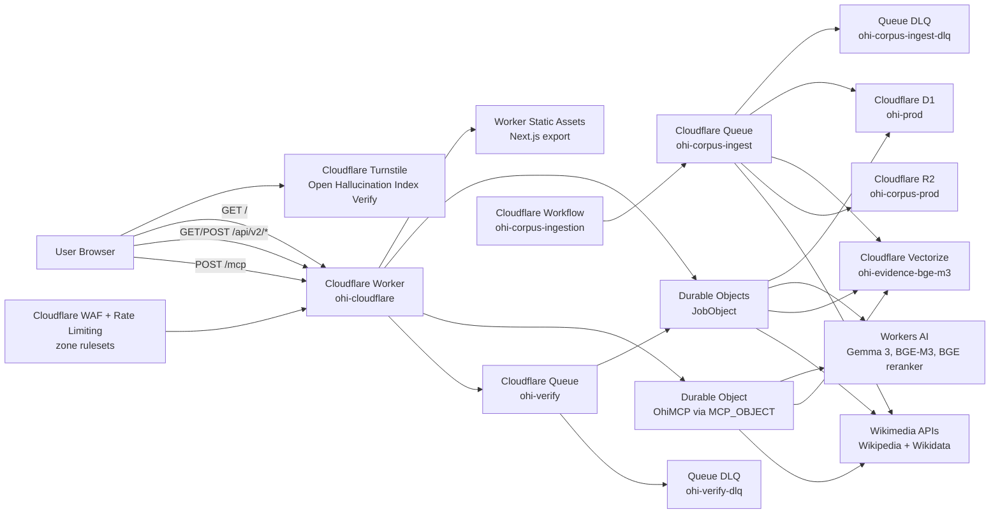

# Current Architecture

**Single Source of Truth (SSoT)** for the OHI production and local-dev topology. If another doc contradicts this file, this file wins and the other doc should be updated.

**Last verified against prod:** 2026-07-05

- Public URL: `https://ohi.shiftbloom.studio`
- Worker: `ohi-cloudflare`
- Latest verified Worker version: `075f7087-7f7c-41d8-aec7-b98f55ac7b0d`
- Health:
  - `GET /health/live`: healthy
  - `GET /health/ready`: D1, Durable Objects, Queue, Workers AI, and Vectorize healthy/configured
  - `GET /health/deep`: `status=ok`, `corpus_store=cloudflare-vectorize+d1+r2`
- Verified end-to-end probe:
  - `/verify` renders the Cloudflare Turnstile widget.
  - Direct `POST /api/v2/verify` without `turnstile_token` returns `403 turnstile_required`.
  - Previous queue consumer probes completed verification jobs using Workers AI, Wikimedia evidence, Vectorize, Durable Objects, and D1.
- Verified MCP:
  - `POST /mcp` initialize succeeds.
  - `tools/list` returns 25 tools: OHI tools plus the migrated multi-source knowledge tools from `src/ohi-mcp-server`.
- Verified corpus seed:
  - Vectorize `ohi-evidence-bge-m3`: 1024 dimensions, cosine metric.
  - D1 corpus: 987 documents, 3,366 chunks, 25 Wikidata entities, 1,263 graph edges.
  - Large hosted seed `cfabf0a5-9c25-419c-a243-b5ea79136155`: 1,189 seen, 1,085 indexed, 3,948 chunks, zero errors.
  - R2 bucket `ohi-corpus-prod`: 739 unique raw corpus JSON objects under the large run prefix.
  - Post-fix idempotency seed `9a6c58df-e5bc-4ac7-b6ca-d5a83d648382`: `batches_total=2`, `batches_completed=2`, zero errors after settle.
  - Corpus/verify queues and DLQs: zero backlog; corpus preview returned zero visible messages.

**Pending deploy (not yet re-verified against prod):** `cloudflare/ohi-worker/src/index.ts` evidence-evaluation rework —
- NLI classification is now an ensemble of two Workers AI models (`@cf/google/gemma-3-12b-it` via `guided_json` + `@cf/meta/llama-3.3-70b-instruct-fp8-fast` via `response_format`/`json_schema`) run concurrently per evidence item, with disagreement downgrading toward neutral/refute instead of trusting a single model's "support" call.
- Every classification now scores a `relevance_score` (does the evidence address the same entity+attribute the claim asserts) separate from the support/refute/neutral label; `buildClaimVerdict` excludes low-relevance evidence from the support/refute signal and applies a graded penalty when the retrieved evidence pool is weak/off-topic, rather than only penalizing zero evidence.
- `retrieveEvidence()` now fans out through the same `knowledge-tools.ts` connectors used by MCP (previously it had its own inline duplicate of Wikipedia/Wikidata search and never called the other 9 sources), selecting sources by `domain_hint`.
- This was implemented and manually reviewed against the generated `worker-configuration.d.ts` types in a session where local Node.js networking was blocked by a machine-level firewall (LuLu.app blocking the freshly-installed Homebrew node binary), so `pnpm run check`/`build` could not be run locally. Needs a real deploy + `/health/deep` + a manual false-claim probe before this note is folded into the verified facts above.

## 1. Production Architecture



### Production Flow Summary

1. Cloudflare DNS routes `ohi.shiftbloom.studio` directly to the Worker custom domain.
2. The Worker serves the statically exported Next.js frontend from `src/frontend/out` via Worker Static Assets.
3. The same Worker handles `GET /health/*`, `GET/POST /api/v2/*`, and `POST /mcp`.
4. `POST /api/v2/verify` validates the request, creates a job in a `JobObject` Durable Object, mirrors job metadata to D1, and sends a message to the `ohi-verify` Queue.
5. The Queue consumer runs the verification pipeline inside the Worker:
   - claim decomposition with Workers AI `@cf/google/gemma-3-12b-it`
   - evidence retrieval from Vectorize, Wikipedia, and Wikidata
   - embedding with Workers AI `@cf/baai/bge-m3`
   - reranking with Workers AI `@cf/baai/bge-reranker-base`
   - NLI classification with Workers AI plus deterministic fallback (see the pending evidence-evaluation rework noted above — not yet deployed)
6. The job Durable Object stores live status and the final verdict; D1 mirrors durable history, feedback, evidence cache, corpus documents/chunks, Wikidata entities, and graph edges.
7. Corpus ingestion is started through admin endpoints, orchestrated by the `ohi-corpus-ingestion` Workflow, fanned out through `ohi-corpus-ingest`, embedded with Workers AI, stored in D1, archived as raw JSON in R2, and upserted into Vectorize. Queue completion is idempotent per `(run_id, batch)` to tolerate at-least-once delivery.
8. MCP is served at `/mcp` by the `OhiMCP` Agents SDK Durable Object binding named `MCP_OBJECT`.
9. Public verification is protected by Cloudflare Turnstile, a `RateLimitObject` Durable Object, and zone WAF/rate-limit rules. The dedicated Turnstile widget is `Open Hallucination Index Verify`.

No production path depends on local tunnels, local GPUs, local databases, Vercel, AWS Lambda, API Gateway, DynamoDB, Bedrock, Neo4j, Qdrant, or a PC-hosted service.

## 2. Cloudflare Resources

| Product | Resource | Purpose |
|---|---|---|
| Workers | `ohi-cloudflare` | Same-origin frontend, API, health, and MCP runtime |
| Worker Static Assets | `src/frontend/out` | Next.js 16 static export |
| Durable Objects | `JobObject` | Per-job live state and status polling |
| Durable Objects | `OhiMCP` / binding `MCP_OBJECT` | Streamable HTTP MCP server |
| Durable Objects | `RateLimitObject` | Per-IP verification rate limiting |
| Workflows | `ohi-corpus-ingestion` | Durable corpus seed orchestration |
| D1 | `ohi-prod` | Job mirror, feedback, evidence cache, corpus metadata, Wikidata graph tables |
| Vectorize | `ohi-evidence-bge-m3` | Evidence embeddings/cache over BGE-M3 vectors |
| R2 | `ohi-corpus-prod` | Raw corpus document archival by run/source/source id |
| Queues | `ohi-verify` | Async verification execution |
| Queues | `ohi-verify-dlq` | Dead-letter queue for failed verification messages |
| Queues | `ohi-corpus-ingest` | Wikipedia/Wikidata corpus ingestion fan-out |
| Queues | `ohi-corpus-ingest-dlq` | Dead-letter queue for failed corpus messages |
| Workers AI | `AI` binding | Claim decomposition, NLI, embeddings, reranking |
| Turnstile | `Open Hallucination Index Verify` | Browser challenge for public verification submissions |
| WAF / Rulesets | `ohi-prod-waf-custom`, `ohi-prod-rate-limits` | SSRF/file-probe blocking, scripted-client challenge, edge rate limiting |
| Observability | Worker observability enabled | Runtime logs and errors |

## 3. Deployment

Cloudflare deployment lives in `cloudflare/ohi-worker/`.

```bash
cd cloudflare/ohi-worker
pnpm install
pnpm run types
pnpm run check
pnpm run build
pnpm run deploy
```

Before deployment, build the frontend export:

```bash
cd src/frontend
NEXT_PUBLIC_API_BASE=https://ohi.shiftbloom.studio/api/v2 \
NEXT_PUBLIC_SITE_URL=https://ohi.shiftbloom.studio \
pnpm run build
```

D1 migrations are in `cloudflare/ohi-worker/migrations/` and are applied with:

```bash
cd cloudflare/ohi-worker
pnpm exec wrangler d1 migrations apply ohi-prod --remote
```

Cloudflare CI/CD is defined in `.github/workflows/cloudflare-production.yml`.

## 4. Local Development

The legacy FastAPI, Docker Compose, GUI ingestion, GUI benchmark, and standalone MCP packages remain in the repo for local development and migration work. They are not in the production path.

Recommended local frontend loop:

```bash
cd src/frontend
pnpm install
NEXT_PUBLIC_API_BASE=http://localhost:8787/api/v2 pnpm run dev
```

Recommended Worker loop:

```bash
cd cloudflare/ohi-worker
pnpm install
pnpm run dev
```

Use full Docker only when you explicitly need to test the legacy local stack.
