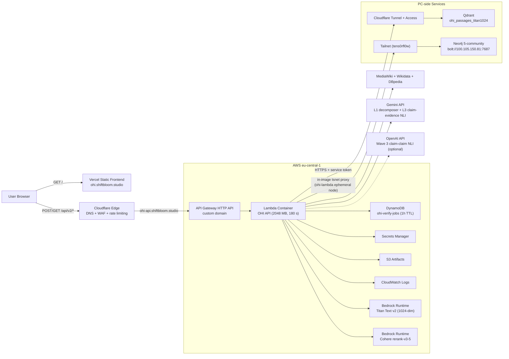
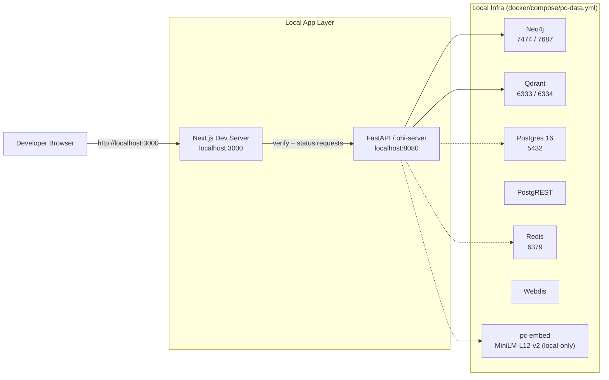
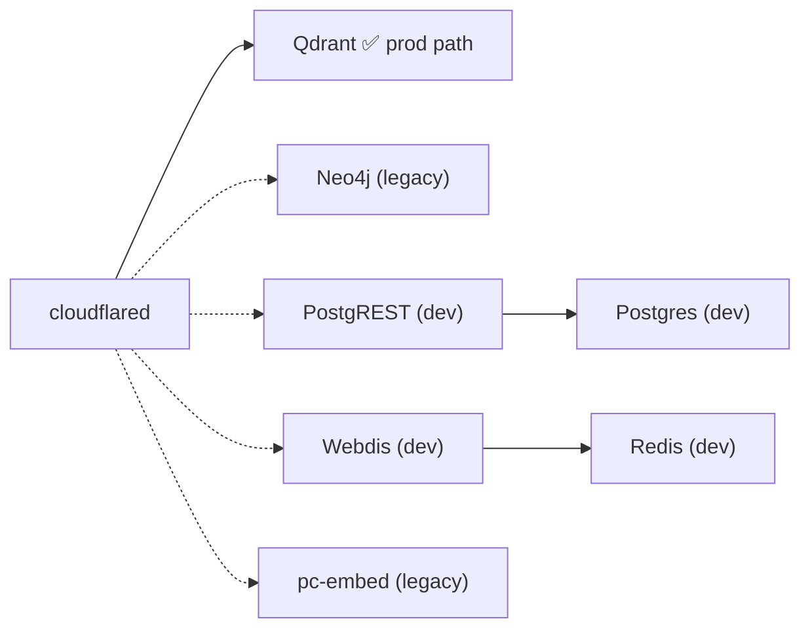

# Current Architecture

**Single Source of Truth (SSoT)** for the OHI production and local-dev
topology. If a claim in `CLAUDE.md`, `README.md`, a runbook, or any
other doc contradicts this file, **this file wins** — other docs should
be updated to match.

Any architectural change MUST update this file in the same commit. See
[CLAUDE.md](../CLAUDE.md#single-source-of-truth-for-architecture) for
the enforcing rule.

**Last verified against prod:** 2026-04-22 (post-Neo4j-Tailscale migration, Phase 1+2 shipped)
- `main` tip: `7a0ac2a` (fix(lambda): copy go.sum into tsproxy builder stage)
- Lambda image (live): `sha-7a0ac2a...` / ECR `:prod`
- Lambda `/health/deep`: **ok** — all layers green, including
  `L1.retrieve.neo4j: ok (~19ms)` through the tsnet-forwarded Tailnet
  route to PC Neo4j.
- Graph-store migration status: **Phase 1+2 shipped.** Aura Pro
  removed; PC-local Neo4j 5-community runs on Tailscale interface
  (`100.105.150.81:7687`); Lambda joins the Tailnet as an ephemeral
  node `ohi-lambda` via the in-image `tsnet` Go proxy (`/opt/tsproxy`)
  and forwards `127.0.0.1:7687` to `tens0rfl0w:7687` over the Tailnet.
  CloudWatch confirms cold-start tsnet bring-up in ~170 ms.
- Evidence path: MCP (MediaWiki + Wikidata + DBpedia) serves verify
  today; GraphRetriever cascade (Qdrant ANN → Aura/PC-Neo4j passage
  fetch → Bedrock Cohere rerank) will activate once Wave 3 Phase E
  corpus ingestion fills `ohi_passages_titan1024`.

This document is based on the current repo state in:

- `README.md`
- `docs/FRONTEND.md`
- `infra/terraform/compute/`
- `infra/terraform/cloudflare/`
- `infra/terraform/storage/`
- `infra/terraform/jobs/`
- `infra/terraform/vercel/`
- `docker/compose/pc-data.yml`
- `docker/compose/docker-compose.yml`
- Live Lambda env (`aws lambda get-function-configuration --function-name ohi-api`)

## 1. Production Architecture

### Production flow summary

1. The browser loads the statically exported frontend from Vercel.
2. The browser POSTs `/api/v2/verify` → receives `202 + job_id`, then
   polls `GET /api/v2/verify/status/{job_id}` until `done` or `error`.
3. Cloudflare protects the public API entrypoint
   (`ohi-api.shiftbloom.studio`) and forwards traffic to the
   API Gateway HTTP API custom domain; an edge-secret is injected into
   `X-OHI-Edge-Secret` by a Transform Rule.
4. API Gateway invokes the Lambda-based OHI API. The sync `/verify`
   entry writes a pending record to DynamoDB, self-async-invokes, and
   returns `202`. The async handler runs the pipeline and writes the
   final verdict back to the same DynamoDB record.
5. **Embeddings** (query + passages): **AWS Bedrock Titan Text
   Embeddings V2**, 1024-dim. Env: `OHI_EMBEDDING_BACKEND=bedrock`,
   `BEDROCK_EMBED_MODEL_ID=amazon.titan-embed-text-v2:0`.
6. **Reranking**: **AWS Bedrock Cohere rerank-v3-5** on the top-40
   Qdrant ANN candidates, returning top-12 passages. Env:
   `BEDROCK_RERANK_ENABLED=true`.
7. **Graph**: Neo4j **5-community on PC** (`ohi-pc-data-neo4j-1`
   container) — Aura Pro was removed 2026-04-22, replaced by a local
   instance reachable on the PC's Tailscale IP
   (`bolt://100.105.150.81:7687`). Lambda joins the Tailnet as
   ephemeral node `ohi-lambda` via the in-image `tsnet` Go proxy
   (`/opt/tsproxy`) and connects via `NEO4J_URI=bolt://127.0.0.1:7687`
   (the proxy's local listener). tsnet bring-up on cold start is
   ~170 ms with a valid reusable-ephemeral auth key.
8. **Vector**: **Qdrant on PC** via Cloudflare Tunnel holds the
   `ohi_passages_titan1024` collection (1024-dim passage embeddings).
   Lambda reaches it at `https://ohi-qdrant.shiftbloom.studio` with
   CF Access service-token headers.
9. **LLM**: **native Gemini adapter** (`src/api/adapters/gemini.py`)
   for both L1 decomposition and L3 claim-evidence NLI. The Gemini
   OpenAI-compat shim is kept in-tree as a fallback (`LLM_BACKEND=openai`)
   but NOT used in prod — the shim silently drops `safetySettings` +
   `generationConfig.thinkingConfig`, unacceptable for a
   hallucination-detection product.
10. **Claim-claim NLI** (Wave 3): OpenAI `gpt-5.4-xhigh` primary,
    Gemini 3 Pro preview fallback. Today `OHI_OPENAI_API_KEY` is unset
    / empty in Lambda, so the dispatcher resolves to Gemini as both
    primary AND fallback (logged as a warning at init).

### Deploy path

- `main` push → GHA workflow `.github/workflows/v2-main-deploy.yml`:
  build image → push to ECR (`:sha-<sha>` immutable + `:prod` mutable)
  → `aws lambda update-function-code --image-uri <digest>` → health
  check → auto-rollback on failure. Terraform is skipped for
  code-only changes.
- Terraform `infra/terraform/compute/` owns env vars, IAM, memory,
  timeout, and the self-invoke permission. Apply only when TF-owned
  config changes.

## 2. Local Development Architecture

### Local flow summary

- Preferred workflow is local-first: run Next.js and FastAPI natively,
  use Docker for supporting infra via the `local-dev` profile in
  `docker/compose/pc-data.yml`.
- Local FastAPI defaults to `OHI_EMBEDDING_BACKEND=local` (in-process
  sentence-transformers). Set `=bedrock` with AWS creds to exercise
  the prod path; set `=remote` to hit the PC-hosted `pc-embed`
  container via HTTP.
- `docker/compose/docker-compose.yml` is a legacy full-stack compose
  that also bundles a Lambda-like API container, MCP server, and
  Nginx. It is retained for end-to-end smoke but is not the canonical
  local workflow.

## 3. PC-side Data Stack

`docker/compose/pc-data.yml` defines the following services under the
`pc-prod` and `local-dev` profiles. **Only Qdrant is in the production
path today**; the others are dev-only, legacy, or future-migration
targets.

| Service | Role | Status in prod | Why |
|---|---|---|---|
| Qdrant | Passage ANN index (`ohi_passages_titan1024`, 1024-dim) | ✅ used | Free-tier HTTP works through CF tunnel; no AWS alternative chosen yet |
| Neo4j 5-community | Graph store | ✅ **live (Phase 1+2)** | Aura removed 2026-04-22. Bolt exposed on Tailscale IP only via `docker/compose/pc-data.tailscale.yml` overlay; Lambda reaches it through the in-image `tsnet` Go proxy (`docker/lambda/tsproxy/`). Auth via reusable-ephemeral Tailscale key stored in SM at `ohi/tailscale-authkey`. |
| pc-embed | `all-MiniLM-L12-v2` HTTP embedder | ❌ legacy | Prod switched to Bedrock Titan v2 for managed availability + 1024-dim parity with the reranker candidate pool |
| Postgres / PostgREST | Relational + REST façade | — dev-only | Never wired into Lambda's verify path |
| Redis / Webdis | Cache + trace store | ❌ disabled | Webdis-over-tunnel doesn't speak native Redis protocol; `REDIS_ENABLED=false` in Lambda. ElastiCache / Upstash migration is backlog |

## 4. Planned changes (not yet shipped)

These are **decided directions that are not reflected in the code or
infra yet** — when implementing, update this section first and then
the rest of the file.

- **Neo4j Aura Pro → PC-local Neo4j 5-community over Tailscale —
  SHIPPED 2026-04-22.**
  - Phase 1: Aura Pro instance removed; PC Neo4j container
    recreated with the `docker/compose/pc-data.tailscale.yml`
    overlay binding bolt (7687) and HTTP (7474) to the PC's
    Tailscale IP (`100.105.150.81`) only — bolt never touches the
    local LAN or the Windows firewall public zone.
  - Phase 2: Lambda-side Tailscale connectivity via the `tsnet`
    Go-proxy in the Lambda container image
    (`docker/lambda/tsproxy/`). The proxy joins the Tailnet as
    `ohi-lambda` (ephemeral) using a reusable+ephemeral auth key
    from Secrets Manager (`ohi/tailscale-authkey`), exposes
    `127.0.0.1:7687` locally, and forwards to `tens0rfl0w:7687`
    over the Tailnet. Lambda connects via
    `NEO4J_URI=bolt://127.0.0.1:7687`. Fail-fast adapter (commit
    `18a91e6`) ensures clean degraded-mode boot when the auth key
    is missing/invalid.
  - Phase 3 (NEXT, optional): swap Qdrant off CF Tunnel and onto
    the same Tailnet route to remove CF Access service-token
    management + centralise PC service auth on Tailscale.
- **OpenAI cc-NLI primary activation.** `CC_NLI_LLM_PROVIDER=openai`
  is set, but `OHI_OPENAI_API_KEY` is currently unset / empty →
  dispatcher falls back to Gemini-as-primary. Activating requires
  populating `ohi/openai-api-key` in Secrets Manager and confirming
  TF plumbs it as `OHI_OPENAI_API_KEY` in Lambda env.
- **Redis / cache migration.** Currently `REDIS_ENABLED=false`.
  ElastiCache-for-Valkey on `cache.t4g.micro` (or Upstash) is the
  target. Unblocks D2 async-verify dedup + L2 claim cache.
- **Corpus ingestion (Wave 3 Phase E).** Qdrant collection
  `ohi_passages_titan1024` and Aura are both empty today. Downloads
  for enwiki, Wikidata, PubMed baseline, OpenAlex, PMC OA, and
  ClinicalTrials are in flight at `/c/ohi-data/`. Post-ingestion, the
  `GraphRetriever` cascade (Qdrant ANN → Aura passage fetch →
  Bedrock rerank) will activate.

## 5. Live env-var reference

The canonical list lives in `infra/terraform/compute/lambda.tf` under
`resource "aws_lambda_function" "api"`. Current values as of the
verified date above:

| Env | Value | Source |
|---|---|---|
| `OHI_ENV` | `prod` | `infra/terraform/compute/lambda.tf` |
| `OHI_REGION` | `eu-central-1` | `var.region` |
| `OHI_EMBEDDING_BACKEND` | `bedrock` | `var.embedding_backend` |
| `BEDROCK_EMBED_MODEL_ID` | `amazon.titan-embed-text-v2:0` | `var.bedrock_embed_model_id` |
| `BEDROCK_EMBED_DIM` | `1024` | `var.bedrock_embed_dim` |
| `BEDROCK_RERANK_ENABLED` | `true` | `var.bedrock_rerank_enabled` |
| `BEDROCK_RERANK_MODEL_ID` | `cohere.rerank-v3-5:0` | `var.bedrock_rerank_model_id` |
| `BEDROCK_RERANK_CANDIDATES` | `40` | `var.bedrock_rerank_candidates` |
| `BEDROCK_RERANK_TOP_N` | `12` | `var.bedrock_rerank_top_n` |
| `NEO4J_URI` | `bolt://127.0.0.1:7687` | `var.neo4j_uri` (points at the in-image tsproxy listener) |
| `TS_AUTHKEY` | (reusable+ephemeral, `ohi/tailscale-authkey`) | `data.aws_secretsmanager_secret_version.tailscale_authkey` |
| `TS_HOSTNAME` | `ohi-lambda` | `var.tailscale_hostname` |
| `TS_UPSTREAM` | `tens0rfl0w:7687` | `var.tailscale_upstream` |
| `TS_LISTEN` | `127.0.0.1:7687` | `var.tailscale_listen` |
| `QDRANT_HOST` | `ohi-qdrant.shiftbloom.studio` | `var.tunnel_hostname_qdrant` |
| `QDRANT_PORT` | `443` | constant |
| `QDRANT_HTTPS` | `true` | constant |
| `QDRANT_COLLECTION_NAME` | `ohi_passages_titan1024` | `var.retrieval_qdrant_collection_name` |
| `QDRANT_VECTOR_SIZE` | `1024` | `var.qdrant_vector_size` |
| `LLM_MODEL` | `gemini-3-flash-preview` | `var.gemini_model` |
| `LLM_BASE_URL` | `https://generativelanguage.googleapis.com/v1beta/openai/` | dead config — native Gemini adapter ignores it; only relevant if `LLM_BACKEND=openai` is ever set |
| `NLI_LLM_MODEL` | `gemini-3-pro-preview` | `var.nli_llm_model` |
| `NLI_SELF_CONSISTENCY_K` | `1` | `var.nli_self_consistency_k` |
| `NLI_THINKING_LEVEL` | `HIGH` | `var.nli_thinking_level` |
| `REDIS_ENABLED` | `false` | constant |
| `JOBS_TABLE_NAME` | `ohi-verify-jobs` | `local.jobs_table_name` |
| `OHI_ASYNC_VERIFY_TTL_SECONDS` | `3600` | `var.async_verify_ttl_seconds` |
| `OHI_CORS_ORIGINS` | `https://ohi.shiftbloom.studio` | `var.cors_origins` |
| `LLM_BACKEND` | (unset) | default → `"gemini"` (native adapter) in `src/api/config/dependencies.py:166` |
| `OHI_OPENAI_API_KEY` | (unset / empty) | would come from `ohi/openai-api-key` secret; not currently plumbed into Lambda env |

## 6. Quick-reference: file paths

- Pipeline DI wiring: [src/api/config/dependencies.py](../src/api/config/dependencies.py) (`_initialize_adapters`)
- Embedding adapter tri-mode: [src/api/adapters/embeddings.py](../src/api/adapters/embeddings.py) (`local` / `remote` / `bedrock`)
- Native Gemini adapter: [src/api/adapters/gemini.py](../src/api/adapters/gemini.py)
- Lambda TF: [infra/terraform/compute/lambda.tf](../infra/terraform/compute/lambda.tf)
- Lambda TF vars + defaults: [infra/terraform/compute/variables.tf](../infra/terraform/compute/variables.tf) and [terraform.tfvars](../infra/terraform/compute/terraform.tfvars)
- PC compose: [docker/compose/pc-data.yml](../docker/compose/pc-data.yml)
- Rollback runbook: [docs/runbooks/rollback-deploy.md](runbooks/rollback-deploy.md)

---

*If anything in this file looks wrong, prefer live verification
(`aws lambda get-function-configuration --function-name ohi-api`,
`git log`, `cat docker/compose/pc-data.yml`) over memory. Update this
file and the code in the same commit — stale architecture docs have
burned past sessions multiple times.*
