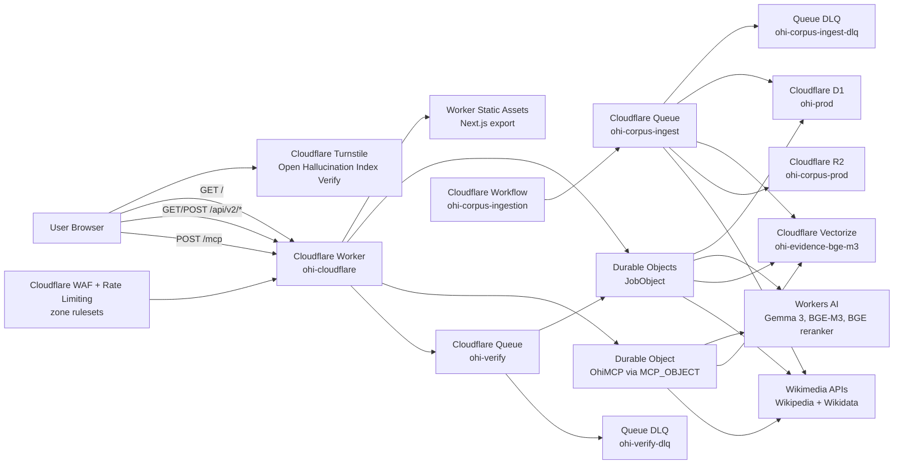

# Current Architecture

**Single Source of Truth (SSoT)** for the OHI production and local-dev topology. If another doc contradicts this file, this file wins and the other doc should be updated.

**Last verified against prod:** 2026-07-05 (evidence-evaluation rework deploy)

- Public URL: `https://ohi.shiftbloom.studio`
- Worker: `ohi-cloudflare`
- Latest verified Worker version: `a7ade597-5916-48ce-9e44-cccf2da0b753` (deployed via `wrangler deploy` directly — GitHub Actions could not run this deploy because the `shiftbloom-studio` GitHub account was billing-locked at push time; `main` and prod matched at deploy time)
- Health:
  - `GET /health/live`: healthy
  - `GET /health/ready`: D1, Durable Objects, Queue, Workers AI, and Vectorize healthy/configured
  - `GET /health/deep`: `status=ok`, `corpus_store=cloudflare-vectorize+d1+r2`, `L3.nli` latency ~5.4s (up from ~60ms pre-rework — confirms the two-model ensemble classification is genuinely running, not a no-op)
- Verified end-to-end probe:
  - `/verify` renders the Cloudflare Turnstile widget.
  - Direct `POST /api/v2/verify` without `turnstile_token` returns `403 turnstile_required`.
  - `POST /api/v2/verify` and `POST /mcp` both trip the zone WAF's scripted-client challenge for non-browser clients (curl) even with a valid admin token — this is by design (bot mitigation) and could not be bypassed to run a curl-based false-claim probe against `/verify` this session. `GET/POST /api/v2/admin/*` is not behind that challenge and was used for the checks below. A manual false-claim check through a real browser at `/verify` is still recommended as a final sanity check.
- Verified MCP:
  - `POST /mcp` initialize succeeds.
  - `tools/list` returns 25 tools: OHI tools plus the migrated multi-source knowledge tools from `src/ohi-mcp-server`.
- Verified corpus seed (via `GET /api/v2/admin/corpus`):
  - Vectorize `ohi-evidence-bge-m3`: 1024 dimensions, cosine metric.
  - D1 corpus: 987 documents / 3,366 chunks at last check before this deploy; a `strategy=random, limit=2000` Wikipedia seed run (`run_id` printed via the admin endpoint) was started after deploy to broaden general-knowledge coverage and was still in progress as of this note — re-check `GET /api/v2/admin/corpus` for current totals.
  - R2 bucket `ohi-corpus-prod`: raw corpus JSON objects archived per run.
  - `ADMIN_TOKEN` Worker secret was rotated this session (old value unknown/unreadable, GitHub Actions will overwrite it again from the `OHI_ADMIN_TOKEN` repo secret on the next successful CI deploy if one is configured).

**Evidence-evaluation rework (deployed, `cloudflare/ohi-worker/src/index.ts`):** fixes basic false claims scoring as high as ~70% true due to a single topically-adjacent but non-entailing "support" classification dominating `p_true` with no penalty for how loosely related the evidence actually was.
- NLI classification is now an ensemble of two Workers AI models (`@cf/google/gemma-3-12b-it` via `guided_json` + `@cf/meta/llama-3.3-70b-instruct-fp8-fast` via `response_format`/`json_schema`) run concurrently per evidence item, with disagreement downgrading toward neutral/refute instead of trusting a single model's "support" call.
- Every classification now scores a `relevance_score` (does the evidence address the same entity+attribute the claim asserts) separate from the support/refute/neutral label; `buildClaimVerdict` excludes low-relevance evidence from the support/refute signal and applies a graded penalty when the retrieved evidence pool is weak/off-topic, rather than only penalizing zero evidence.
- `retrieveEvidence()` now fans out through the same `knowledge-tools.ts` connectors used by MCP (previously it had its own inline duplicate of Wikipedia/Wikidata search and never called the other 9 sources), selecting sources by `domain_hint`.
- Verified by: a standalone Node script reproducing the reported bug scenario against the old vs. new scoring formula (0.692 → 0.352 for the reported failure mode); full local CI-equivalent gate (`tsc --noEmit`, `wrangler deploy --dry-run`, frontend `eslint`, `vitest run` — 142/142 tests, `next build`); and the `/health/deep` latency change above post-deploy.

**Cost-tiered Rigor profiles (pending deploy, `RIGOR_PROFILES` in `cloudflare/ohi-worker/src/index.ts`):** the `fast`/`balanced`/`maximum` rigor options and `coverage_target` (80/90/95%) exposed in the frontend `VerifyForm` were already wired end-to-end to the backend, but `fast` and `balanced` were previously identical in cost (same evidence-per-claim, same two-model ensemble) and `maximum` silently capped at the same claim count as `balanced` given the default `VERIFY_MAX_CLAIMS=8` — none of the three tiers had a real cost ceiling. Fixed by sizing each tier against live Workers AI pricing fetched 2026-07-05:
  - `fast`: 4 claims, 3 evidence/claim, **single-model** classification (`@cf/meta/llama-4-scout-17b-16e-instruct`, no ensemble) — ~$0.005/request worst case.
  - `balanced` (default): 7 claims, 4 evidence/claim, two-model ensemble (`gemma-3-12b-it` + `llama-3.3-70b-instruct-fp8-fast`, same as the evidence-evaluation rework above) — ~$0.031/request worst case, under the $0.035 target.
  - `maximum`: 13 claims, 6 evidence/claim, same ensemble as `balanced` but more of it — ~$0.085/request worst case, under the $0.10 target. Gated by a new per-IP cooldown (`MAXIMUM_RIGOR_COOLDOWN_SECONDS`, default 90s, via the existing `RateLimitObject` DO under a separate `maximum-cooldown` key) limiting clients to one `maximum`-rigor request per cooldown window, on top of the existing general 12/min rate limit.
  - `VERIFY_MAX_CLAIMS` (env var, now `13`) is an optional additional ceiling that can only further restrict a tier's claim count, never raise it — this closes a gap where an explicit `max_claims` override could previously push `balanced`/`fast` requests up to `maximum`'s claim count and exceed their cost ceiling.
  - `coverage_target` continues to only adjust the reported confidence-interval width (wider interval for a higher target) — there is no calibration dataset (`calibration_n` is 0 everywhere) backing a genuine statistical coverage guarantee, so this is honestly a heuristic width knob, not conformal-prediction-style calibration.
  - Model research (fetched live, 2026-07-05): `@cf/google/gemma-4-26b-a4b-it` is a cheaper, larger-context successor to `gemma-3-12b-it` (which is already past its Cloudflare-stated deprecation date of 5/30/2026) but is a reasoning/"thinking" model — an empirical test against the Workers AI REST API showed it needs a much larger `max_tokens` budget and a different response-parsing path than the current code has (content came back `null` with reasoning text in a separate field, truncated at `max_tokens=400`) — tracked as a follow-up, not swapped in this change. `@cf/meta/llama-4-scout-17b-16e-instruct` (MoE, cheaper, empirically confirmed to produce clean JSON via `response_format`) is used for the `fast` tier only; it is not in Cloudflare's documented JSON-mode-supported-models list and has no verified NLI-quality benchmark, so it was not used to replace the proven `llama-3.3-70b-instruct-fp8-fast` in the `balanced`/`maximum` ensemble. No newer BAAI embedding/reranker model exists on Workers AI (`bge-m3`/`bge-reranker-base` remain the only options); `@cf/google/embeddinggemma-300m` exists but is a different (768 vs 1024) dimension and would require a full Vectorize index migration, and Cloudflare has not yet published pricing for it. No diffusion-architecture text-generation model exists on Workers AI at all (the only diffusion models offered are image models).

## 1. Production Architecture



### Production Flow Summary

1. Cloudflare DNS routes `ohi.shiftbloom.studio` directly to the Worker custom domain.
2. The Worker serves the statically exported Next.js frontend from `src/frontend/out` via Worker Static Assets.
3. The same Worker handles `GET /health/*`, `GET/POST /api/v2/*`, and `POST /mcp`.
4. `POST /api/v2/verify` validates the request, creates a job in a `JobObject` Durable Object, mirrors job metadata to D1, and sends a message to the `ohi-verify` Queue.
5. The Queue consumer runs the verification pipeline inside the Worker:
   - claim decomposition with Workers AI `@cf/google/gemma-3-12b-it`
   - evidence retrieval from Vectorize, Wikipedia, and Wikidata
   - embedding with Workers AI `@cf/baai/bge-m3`
   - reranking with Workers AI `@cf/baai/bge-reranker-base`
   - NLI classification with Workers AI plus deterministic fallback (see the pending evidence-evaluation rework noted above — not yet deployed)
6. The job Durable Object stores live status and the final verdict; D1 mirrors durable history, feedback, evidence cache, corpus documents/chunks, Wikidata entities, and graph edges.
7. Corpus ingestion is started through admin endpoints, orchestrated by the `ohi-corpus-ingestion` Workflow, fanned out through `ohi-corpus-ingest`, embedded with Workers AI, stored in D1, archived as raw JSON in R2, and upserted into Vectorize. Queue completion is idempotent per `(run_id, batch)` to tolerate at-least-once delivery.
8. MCP is served at `/mcp` by the `OhiMCP` Agents SDK Durable Object binding named `MCP_OBJECT`.
9. Public verification is protected by Cloudflare Turnstile, a `RateLimitObject` Durable Object, and zone WAF/rate-limit rules. The dedicated Turnstile widget is `Open Hallucination Index Verify`.

No production path depends on local tunnels, local GPUs, local databases, Vercel, AWS Lambda, API Gateway, DynamoDB, Bedrock, Neo4j, Qdrant, or a PC-hosted service.

## 2. Cloudflare Resources

| Product | Resource | Purpose |
|---|---|---|
| Workers | `ohi-cloudflare` | Same-origin frontend, API, health, and MCP runtime |
| Worker Static Assets | `src/frontend/out` | Next.js 16 static export |
| Durable Objects | `JobObject` | Per-job live state and status polling |
| Durable Objects | `OhiMCP` / binding `MCP_OBJECT` | Streamable HTTP MCP server |
| Durable Objects | `RateLimitObject` | Per-IP verification rate limiting |
| Workflows | `ohi-corpus-ingestion` | Durable corpus seed orchestration |
| D1 | `ohi-prod` | Job mirror, feedback, evidence cache, corpus metadata, Wikidata graph tables |
| Vectorize | `ohi-evidence-bge-m3` | Evidence embeddings/cache over BGE-M3 vectors |
| R2 | `ohi-corpus-prod` | Raw corpus document archival by run/source/source id |
| Queues | `ohi-verify` | Async verification execution |
| Queues | `ohi-verify-dlq` | Dead-letter queue for failed verification messages |
| Queues | `ohi-corpus-ingest` | Wikipedia/Wikidata corpus ingestion fan-out |
| Queues | `ohi-corpus-ingest-dlq` | Dead-letter queue for failed corpus messages |
| Workers AI | `AI` binding | Claim decomposition, NLI, embeddings, reranking |
| Turnstile | `Open Hallucination Index Verify` | Browser challenge for public verification submissions |
| WAF / Rulesets | `ohi-prod-waf-custom`, `ohi-prod-rate-limits` | SSRF/file-probe blocking, scripted-client challenge, edge rate limiting |
| Observability | Worker observability enabled | Runtime logs and errors |

## 3. Deployment

Cloudflare deployment lives in `cloudflare/ohi-worker/`.

```bash
cd cloudflare/ohi-worker
pnpm install
pnpm run types
pnpm run check
pnpm run build
pnpm run deploy
```

Before deployment, build the frontend export:

```bash
cd src/frontend
NEXT_PUBLIC_API_BASE=https://ohi.shiftbloom.studio/api/v2 \
NEXT_PUBLIC_SITE_URL=https://ohi.shiftbloom.studio \
pnpm run build
```

D1 migrations are in `cloudflare/ohi-worker/migrations/` and are applied with:

```bash
cd cloudflare/ohi-worker
pnpm exec wrangler d1 migrations apply ohi-prod --remote
```

Cloudflare CI/CD is defined in `.github/workflows/cloudflare-production.yml`.

## 4. Local Development

The legacy FastAPI, Docker Compose, GUI ingestion, GUI benchmark, and standalone MCP packages remain in the repo for local development and migration work. They are not in the production path.

Recommended local frontend loop:

```bash
cd src/frontend
pnpm install
NEXT_PUBLIC_API_BASE=http://localhost:8787/api/v2 pnpm run dev
```

Recommended Worker loop:

```bash
cd cloudflare/ohi-worker
pnpm install
pnpm run dev
```

Use full Docker only when you explicitly need to test the legacy local stack.
