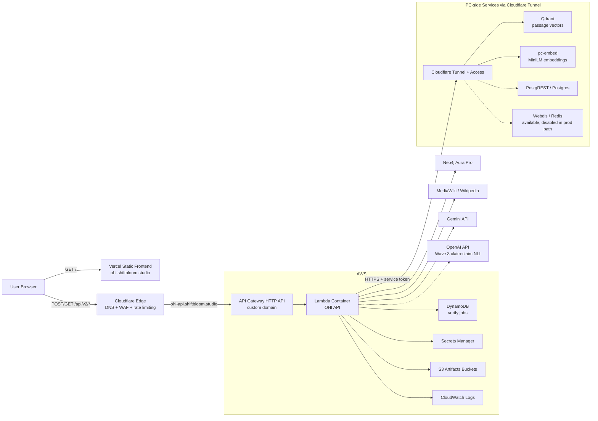
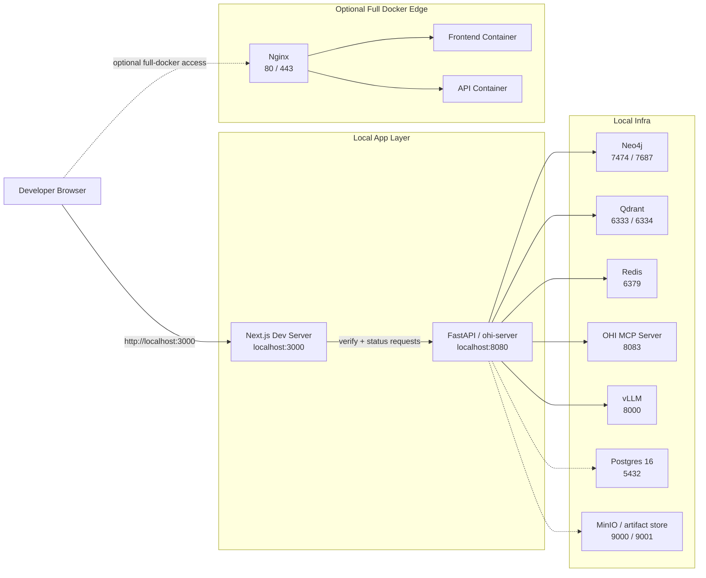
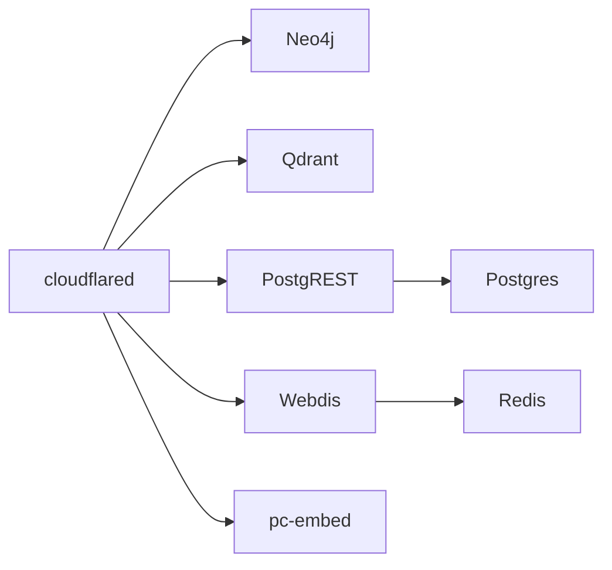

# Current Architecture

This document captures the current architecture that is actively used in this
repository across:

- production: hybrid deployment across Vercel, Cloudflare, AWS, and PC-hosted services
- local development: browser + local app processes with Docker-backed infra

The diagrams below are based on the current repo state in:

- `README.md`
- `docs/FRONTEND.md`
- `infra/terraform/compute/`
- `infra/terraform/cloudflare/`
- `infra/terraform/storage/`
- `infra/terraform/jobs/`
- `infra/terraform/vercel/`
- `docker/compose/pc-data.yml`
- `docker/compose/docker-compose.yml`

## 1. Production Architecture

### Production flow summary

1. The browser loads the statically exported frontend from Vercel.
2. The browser talks directly to the public API domain for verify polling.
3. Cloudflare protects the public API entrypoint and forwards traffic to the
   API Gateway custom domain.
4. API Gateway invokes the Lambda-based OHI API.
5. Lambda stores async job state in DynamoDB and reads secrets from Secrets
   Manager.
6. Verification uses Gemini, MediaWiki, Neo4j Aura, and the PC-hosted vector
   and embedding services exposed through Cloudflare Tunnel + Access.

## 2. Local Development Architecture

### Local flow summary

- Preferred feature workflow is local-first: run Next.js and FastAPI locally,
  use Docker for supporting infra.
- The older full Docker stack still exists for end-to-end validation and routes
  browser traffic through Nginx.
- The local v2 support stack also includes Postgres and MinIO for algorithm and
  artifact workflows.

## 3. PC-side Data Stack Used by Production

This is the local machine-side service group that is exposed selectively to AWS
through Cloudflare Tunnel in the current hybrid production setup.
