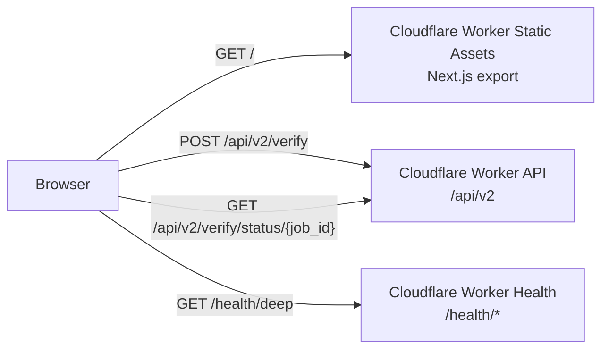

# Open Hallucination Index — Frontend Documentation

> **Status:** Next.js 16 static export served by Cloudflare Worker Static Assets at `https://ohi.shiftbloom.studio`.
> The browser talks to the same origin API at `https://ohi.shiftbloom.studio/api/v2`.

---

## Deployment

- **Hosting:** Cloudflare Worker Static Assets, configured in `cloudflare/ohi-worker/wrangler.jsonc`.
- **Domain:** `ohi.shiftbloom.studio` Worker custom domain.
- **Build output:** `src/frontend/out`.
- **Production env vars:**
  - `NEXT_PUBLIC_API_BASE=https://ohi.shiftbloom.studio/api/v2`
  - `NEXT_PUBLIC_SITE_URL=https://ohi.shiftbloom.studio`

Build the frontend before deploying the Worker:

```bash
cd src/frontend
NEXT_PUBLIC_API_BASE=https://ohi.shiftbloom.studio/api/v2 \
NEXT_PUBLIC_SITE_URL=https://ohi.shiftbloom.studio \
pnpm run build
```

Then deploy from the Worker package:

```bash
cd cloudflare/ohi-worker
pnpm run deploy
```

---

## Architecture

The frontend is a static Next.js App Router export. Dynamic behavior is client-side and talks to the same Cloudflare Worker origin.



There is no Next.js server runtime in production and no frontend proxy route. The API client lives in `src/frontend/src/lib/ohi-client.ts`.

---

## Primary Pages

| Route | Purpose | State |
|---|---|---|
| `/` | Landing page | Static |
| `/verify` | Main verify flow | Client-side reducer and polling |
| `/status` | Public health page | Client-side health fetch |
| `/calibration` | Calibration report | Client-side report fetch |
| `/about`, `/disclaimer`, `/agb`, `/datenschutz`, `/impressum`, `/eula`, `/cookies`, `/accessibility` | Legal and informational pages | Static |

---

## Key Modules

- `src/frontend/src/lib/ohi-client.ts`
  - `ohi.verify(req)` → `POST /api/v2/verify`
  - `ohi.verifyStatus(jobId)` → `GET /api/v2/verify/status/{job_id}`
  - `ohi.calibrationReport()` → `GET /api/v2/calibration/report`
  - `ohi.healthLive()`, `ohi.healthReady()`, `ohi.healthDeep()` → root `/health/*`
- `src/frontend/src/lib/verify-controller.ts`
  - Client-side submit/poll/done/error state machine.
  - Polls hosted Durable Object job status until terminal state.
- `src/frontend/src/lib/ohi-types.ts`
  - TypeScript schemas for the public API contract.

---

## Verification Commands

```bash
cd src/frontend
pnpm run lint
pnpm run test:run
NEXT_PUBLIC_API_BASE=https://ohi.shiftbloom.studio/api/v2 \
NEXT_PUBLIC_SITE_URL=https://ohi.shiftbloom.studio \
pnpm run build
```

Production smoke:

```bash
curl -sS https://ohi.shiftbloom.studio/health/ready
curl -sS https://ohi.shiftbloom.studio/health/deep
curl -sS -X POST https://ohi.shiftbloom.studio/api/v2/verify \
  -H 'content-type: application/json' \
  --data '{"text":"The Eiffel Tower is in Paris.","options":{"rigor":"fast","max_claims":1}}'
```
