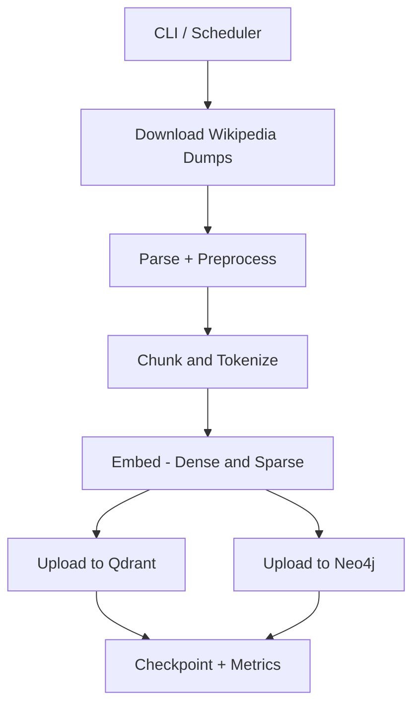

# Wikipedia Ingestion Pipeline

High-performance Wikipedia ingestion pipeline for the Open Hallucination Index project. Built for throughput, resumability, and rich knowledge graph creation.

---

## Highlights

- **10–50x faster** than the original monolithic script
- **Parallel dump processing** with configurable worker counts
- **Producer-consumer architecture** with non-blocking queues
- **Parallel downloads** with resume support
- **GPU-accelerated embeddings** with dedicated workers
- **Async uploads** to both Qdrant and Neo4j
- **10+ relationship types** in Neo4j knowledge graph
- **Resumable checkpoints** for crash recovery
- **Real-time progress** with rich statistics

---

## End-to-end workflow



### Pipeline stages (threaded)

```
┌─────────────┐    ┌──────────────┐    ┌─────────────┐    ┌─────────────┐
│  Download   │───▶│ Dump Workers │───▶│   Embed     │───▶│   Upload    │
│  (4 threads)│    │ (2 workers)  │    │ (2 workers) │    │ (4 threads) │
└─────────────┘    └──────────────┘    └─────────────┘    └─────────────┘
      │                  │                   │                   │
      ▼                  ▼                   ▼                   ▼
   Wikipedia         Parallel Parse      GPU Encode        Qdrant + Neo4j
    Dumps            + Preprocess        + BM25 Sparse     Parallel Upload
```

---

## Multi-worker architecture

- **Dump Workers** (`--dump-workers`): Multiple dump files processed simultaneously
- **Preprocess Workers** (`--preprocess-workers`): Parallel text cleaning + chunking
- **Embedding Workers** (`--embedding-workers`): Dedicated GPU/CPU embedding workers
- **Upload Workers** (`--upload-workers`): Async uploads to Qdrant and Neo4j

This decouples stages so slow I/O does not block CPU/GPU stages.

---

## Quick start

```bash
# Run from project root
cd src/ingestion
python -m ingestion --help

# Basic usage with defaults
python -m ingestion --limit 10000

# Balanced settings (recommended for 64GB RAM + RTX 4090)
python -m ingestion \
    --batch-size 384 \
    --dump-workers 3 \
    --preprocess-workers 12 \
    --embedding-workers 3 \
    --upload-workers 2 \
    --embedding-batch-size 768 \
    --embedding-device cuda

# Endless mode with auto-retry on network errors
python -m ingestion --endless --keep-downloads
```

---

## Module structure

| Module | Description |
|--------|-------------|
| `models.py` | Data classes: `WikiArticle`, `ProcessedChunk`, `IngestionConfig` |
| `downloader.py` | Parallel Wikipedia dump downloading with resume |
| `preprocessor.py` | Text cleaning, chunking, BM25 tokenization |
| `qdrant_store.py` | Async vector store with GPU embeddings |
| `neo4j_store.py` | Graph store with 10+ relationship types |
| `checkpoint.py` | Resumable ingestion state management |
| `pipeline.py` | Main producer-consumer orchestration |
| `__main__.py` | CLI entry point |

---

## Neo4j relationship types (core set)

| Relationship | Description |
|--------------|-------------|
| `LINKS_TO` | Internal wiki links between articles |
| `IN_CATEGORY` | Article belongs to category |
| `MENTIONS` | Article mentions entity |
| `SEE_ALSO` | Explicit "See also" references |
| `DISAMBIGUATES` | Disambiguation page links |
| `LOCATED_IN` | Geographic location relationships |
| `HAS_OCCUPATION` | Person's occupation |
| `HAS_NATIONALITY` | Person's nationality |
| `RELATED_TO` | Category co-occurrence relationships |
| `NEXT` | Section ordering within article |

---

## Configuration options

### Performance tuning

```python
IngestionConfig(
    batch_size=256,              # Articles per batch
    chunk_size=512,              # Characters per chunk
    chunk_overlap=64,            # Overlap between chunks

    # Worker configuration
    dump_workers=2,              # Parallel dump file workers
    download_workers=4,          # Parallel download threads
    preprocess_workers=8,        # Text processing threads
    embedding_workers=2,         # GPU embedding workers
    upload_workers=4,            # Upload threads per store

    # Queue sizes
    download_queue_size=8,       # Pending downloads
    preprocess_queue_size=2048,  # Pending articles
    upload_queue_size=16,        # Pending batches

    # Embedding settings
    embedding_batch_size=512,    # GPU batch size
    embedding_device="cuda",     # "cuda", "cpu", or "auto"
)
```

### Recommended settings by hardware

| RAM | GPU | dump_workers | embedding_workers | batch_size |
|-----|-----|--------------|-------------------|------------|
| 16GB | None | 1 | 1 | 128 |
| 32GB | 8GB | 2 | 2 | 256 |
| 64GB | 12GB+ | 3 | 3 | 384 |
| 128GB | 24GB+ | 8 | 8 | 1024 |

### Database settings

```python
IngestionConfig(
    qdrant_url="http://localhost:6333",
    qdrant_collection="wiki_articles",
    neo4j_uri="bolt://localhost:7687",
    neo4j_user="neo4j",
    neo4j_password="password",
    neo4j_database="neo4j",
)
```

---

## Requirements (minimum)

```txt
sentence-transformers>=2.2.0
qdrant-client>=1.6.0
neo4j>=5.0.0
lxml>=4.9.0
mwparserfromhell>=0.6.0
nltk>=3.8.0
tqdm>=4.65.0
```

---

## Performance comparison

| Metric | Original | New Pipeline | Improvement |
|--------|----------|--------------|-------------|
| Articles/sec | ~1 | 10–50 | 10–50x |
| CPU utilization | ~10% | ~80% | 8x |
| GPU utilization | 0% | ~90% | Full usage |
| Memory efficiency | High | Streamed | Lower peak |
| Relationship types | 3 | 10+ | 3x+ |
| Crash recovery | None | Checkpoint | Full resume |

---

## Operational tips

- **IO-bound**: Increase `--download-workers` when network is the bottleneck.
- **CPU-bound**: Increase `--preprocess-workers` for faster parsing.
- **GPU-bound**: Increase `--embedding-batch-size` and `--embedding-workers` (within VRAM).
- **Queue tuning**: If workers are idle, increase queue sizes.
- **Resume**: Keep checkpoints on fast disk for reliable recovery.

---

## Troubleshooting

### Low GPU utilization
- Increase `--batch-size` (try 512 or 1024)
- Ensure CUDA is available: `torch.cuda.is_available()`

### Memory issues
- Reduce `--preprocess-queue-size` (default: 2048)
- Reduce `--batch-size` for smaller GPU memory

### Network bottleneck
- Increase `--download-workers` for faster downloads
- Use local file with `--wiki-dump` for best performance

### Neo4j connection issues
- Check connection pool: increase `--upload-workers`
- Verify credentials and database name

---

## Legacy compatibility

The original script has been replaced by a thin wrapper:

```bash
# Both commands are equivalent:
python -m ingestion [args...]
python src/api/scripts/ingest_wiki_dual.py [args...]
```
