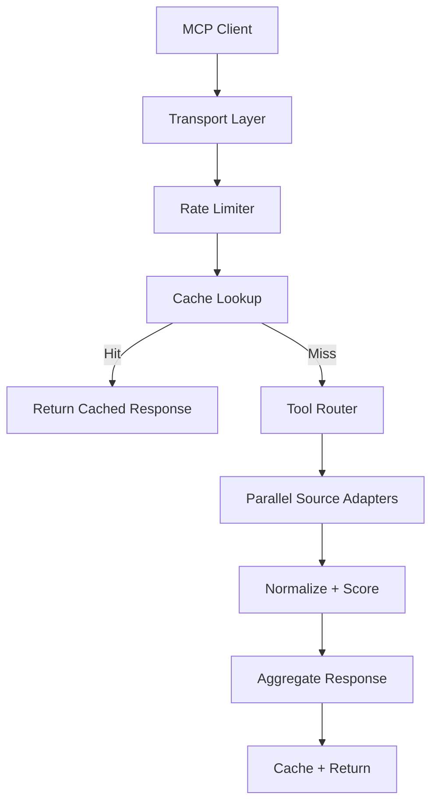
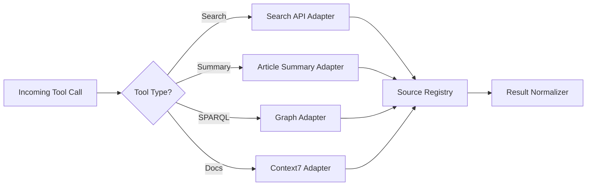

# OHI MCP Server

**Unified Knowledge Sources MCP Server for Open Hallucination Index**

High-performance MCP (Model Context Protocol) server that aggregates 13+ external knowledge sources into a single, unified interface. It is optimized for parallel search, controlled rate limits, and predictable latency under load.

---

## Highlights

- **🚀 High Performance**: Async parallel queries with connection pooling
- **📦 Unified Interface**: 21 MCP tools across all sources
- **🔒 Rate Limiting**: Token bucket per source to avoid throttling
- **💾 Response Caching**: LRU cache with configurable TTL
- **📊 Observability**: Health + stats endpoints for runtime insight

---

## End-to-end workflow



### Tool-routing strategy (mental model)



---

## Knowledge sources

### Wikipedia / Knowledge Graph
- **Wikidata** - Entity search + SPARQL
- **MediaWiki Action API** - Wikipedia search
- **Wikimedia REST** - Article summaries
- **DBpedia** - Structured graph lookup

### Technical Documentation
- **Context7** - Library and API documentation

### Academic / Research
- **OpenAlex** - Scholarly works
- **Crossref** - DOI metadata
- **Europe PMC** - Life sciences literature
- **OpenCitations** - Citation data

### Medical
- **PubMed/NCBI** - Biomedical literature
- **ClinicalTrials.gov** - Clinical study data

### News & Events
- **GDELT** - Global news and events

### Economic
- **World Bank** - Economic indicators

### Security
- **OSV** - Open Source Vulnerabilities database

---

## Available tools

| Tool | Description |
|------|-------------|
| `search_all` | Search across ALL sources simultaneously |
| `search_wikipedia` | Search Wikipedia articles |
| `get_wikipedia_summary` | Get article summary |
| `get_summary` | Get article summary (plain text) |
| `search_wikidata` | Search Wikidata entities |
| `query_wikidata_sparql` | Execute SPARQL queries |
| `search_dbpedia` | Query DBpedia knowledge graph |
| `resolve-library-id` | Resolve a Context7-compatible library ID |
| `query-docs` | Retrieve Context7 documentation context |
| `search_academic` | Search academic literature |
| `search_openalex` | Search OpenAlex works |
| `search_crossref` | Search Crossref publications |
| `get_doi_metadata` | Get DOI metadata |
| `search_pubmed` | Search PubMed articles |
| `search_europepmc` | Search Europe PMC |
| `search_clinical_trials` | Search clinical studies |
| `get_citations` | Get citation data for DOI |
| `search_gdelt` | Search global news |
| `get_world_bank_indicator` | Get economic indicators |
| `search_vulnerabilities` | Search OSV database |
| `get_vulnerability` | Get vulnerability details |

---

## API endpoints

- `GET /health` - Health check
- `GET /sse` - SSE endpoint for MCP
- `POST /messages` - Message handler for MCP
- `GET /stats` - Server statistics

---

## Docker usage

### Build
```bash
docker build -f docker/mcp-server/Dockerfile -t ohi-mcp-server .
```

### Run
```bash
docker run -p 8080:8080 ohi-mcp-server
```

### Environment variables
| Variable | Default | Description |
|----------|---------|-------------|
| `PORT` | `8080` | Server port |
| `TRANSPORT` | `sse` | Transport mode (`sse` or `stdio`) |
| `CACHE_TTL` | `300` | Cache TTL in seconds |
| `ENABLE_CACHE` | `true` | Enable response caching |
| `LOG_LEVEL` | `info` | Logging level |
| `POLITE_POOL_EMAIL` | - | Email for Crossref/OpenAlex polite pool access |
| `CONTEXT7_API_KEY` | - | Context7 API key for higher limits |
| `CONTEXT7_BASE_URL` | `https://context7.com` | Base URL for Context7 REST API |

---

## Polite pool access

Set `POLITE_POOL_EMAIL` to enable higher rate limits for academic APIs:

- **Crossref**: 50 req/sec (vs 1 req/sec anonymous) - [Documentation](https://github.com/CrossRef/rest-api-doc#good-manners--more-reliable-service)
- **OpenAlex**: 100k req/day with faster response - [Documentation](https://docs.openalex.org/how-to-use-the-api/rate-limits-and-authentication)

```bash
docker run -p 8080:8080 -e POLITE_POOL_EMAIL=api@example.org ohi-mcp-server
```

---

## Operations tips

- **Latency tuning**: Reduce `CACHE_TTL` for fresher results or increase it for stability.
- **Throttling**: Rate-limiter is per-source; keep `POLITE_POOL_EMAIL` set for academic APIs.
- **Transport**: Use `sse` for long-lived MCP sessions; use `stdio` for local CLI tooling.
- **Context7**: Provide `CONTEXT7_API_KEY` for higher limits.

---

## Development

```bash
# Install dependencies
npm install

# Run in development mode
npm run dev

# Build for production
npm run build

# Type check
npm run typecheck
```

---

## Architecture

```
src/
├── index.ts           # Main entry point
├── aggregator.ts      # Tool call routing
├── sources/           # Knowledge source implementations
│   ├── base.ts        # Base source interface
│   ├── registry.ts    # Source management
│   ├── wikidata.ts
│   ├── mediawiki.ts
│   ├── wikimedia-rest.ts
│   ├── dbpedia.ts
│   ├── openalex.ts
│   ├── crossref.ts
│   ├── europepmc.ts
│   ├── ncbi.ts
│   ├── clinicaltrials.ts
│   ├── opencitations.ts
│   ├── gdelt.ts
│   ├── worldbank.ts
│   └── osv.ts
└── utils/
    ├── cache.ts       # LRU response cache
    ├── rate-limiter.ts # Token bucket rate limiting
    ├── http-client.ts  # Shared HTTP client
    └── context7.ts     # Context7 REST helpers
```

---

## License

MIT
